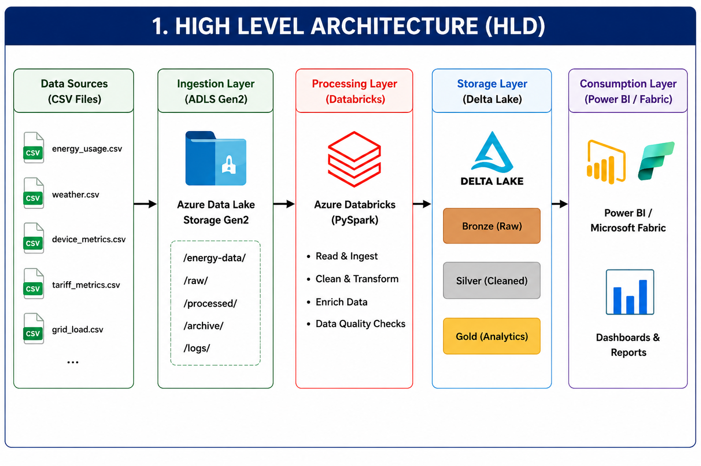
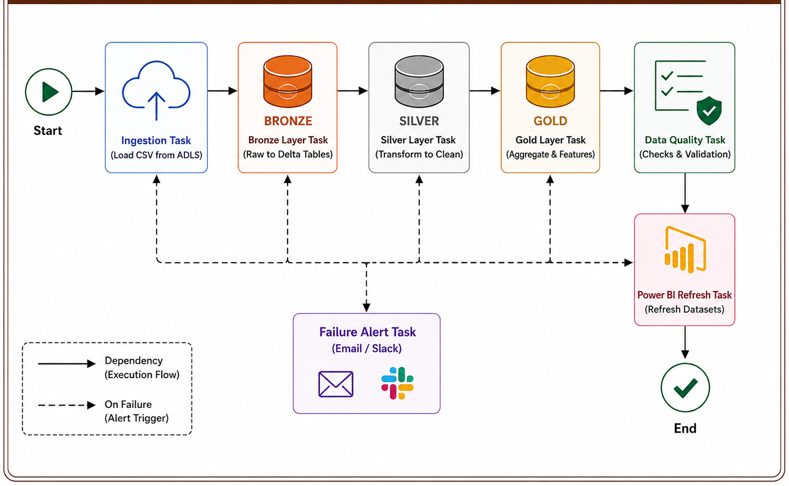

# ⚡ Energy Consumption Forecasting Pipeline
Production-ready Azure Data Engineering project for Energy Consumption Forecasting using ADLS Gen2, Azure Databricks (PySpark), Delta Lake (Bronze, Silver, Gold), Apache Airflow, and Power BI. Implements ETL, data quality checks, feature engineering, and Star Schema modeling for analytics and reporting.

## 📖 Project Overview

The **Energy Consumption Forecasting Pipeline** is an end-to-end Azure Data Engineering project designed to build a scalable and reliable data pipeline for energy consumption analytics and forecasting. The project follows the **Medallion Architecture (Bronze, Silver, Gold)** to ingest, transform, validate, and prepare business-ready data for reporting and analytics.

The pipeline uses Azure Data Lake Storage Gen2 (ADLS), Azure Data Factory, Azure Databricks, Delta Lake, Apache Airflow, Databricks SQL Warehouse, and Microsoft Power BI to implement a modern Lakehouse architecture.

---

#  High Level Architecture

<p align="center">
    
</p>

---

# 🥉🥈🥇 Medallion Architecture

<p align="center">
    
</p>

---

# 🛠️ Technology Stack

- Azure Data Lake Storage Gen2 (ADLS)
- Azure Data Factory
- Azure Databricks
- PySpark
- Delta Lake
- Unity Catalog
- Apache Airflow
- Databricks SQL Warehouse
- Microsoft Power BI
- Git & GitHub

---

# 📂 Project Workflow

```text
CSV Files
    │
    ▼
Azure Data Lake Storage Gen2
    │
    ▼
Azure Data Factory
(CSV → Parquet)
    │
    ▼
Azure Databricks
    │
    ▼
Bronze Layer
    │
    ▼
Silver Layer
    │
    ▼
Gold Layer
    │
    ▼
Databricks SQL Warehouse
    │
    ▼
Power BI Dashboard
```

---

# ✅ Implementation Progress

## Step 1 – Load Source Files into ADLS Gen2

**Objective**

Upload all source CSV datasets into Azure Data Lake Storage Gen2 for centralized and scalable storage.

**Activities Performed**

- Created Azure Storage Account
- Created ADLS Gen2 Container
- Uploaded source CSV files into ADLS
- Verified successful file upload

---

## Step 2 – Convert CSV Files to Parquet

**Objective**

Convert raw CSV files into Parquet format using Azure Data Factory to improve storage efficiency and query performance.

**Activities Performed**

- Created Azure Data Factory Pipeline
- Configured Source Dataset (CSV)
- Configured Sink Dataset (Parquet)
- Converted CSV files to Parquet
- Stored Parquet files back into ADLS

Azure Data Engineer | Azure Databricks | PySpark | Delta Lake | Power BI
