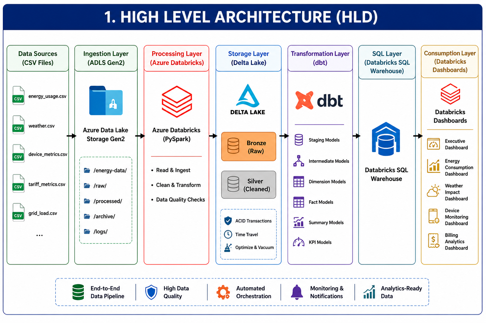
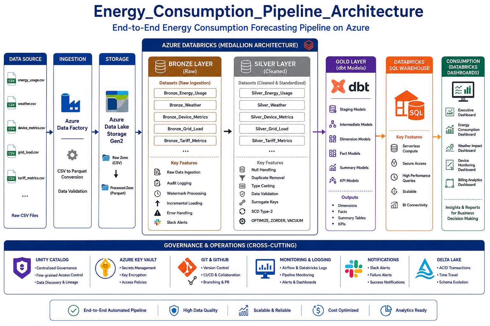
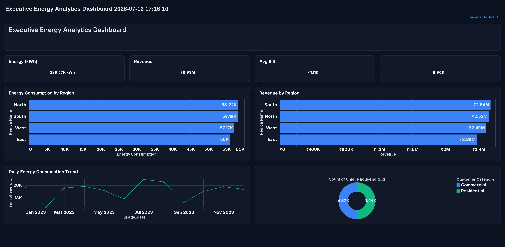
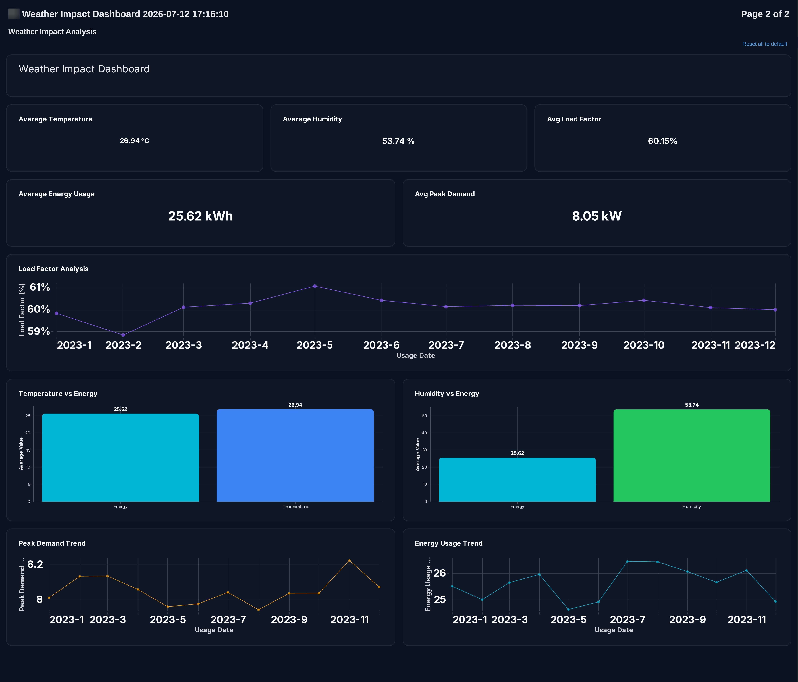
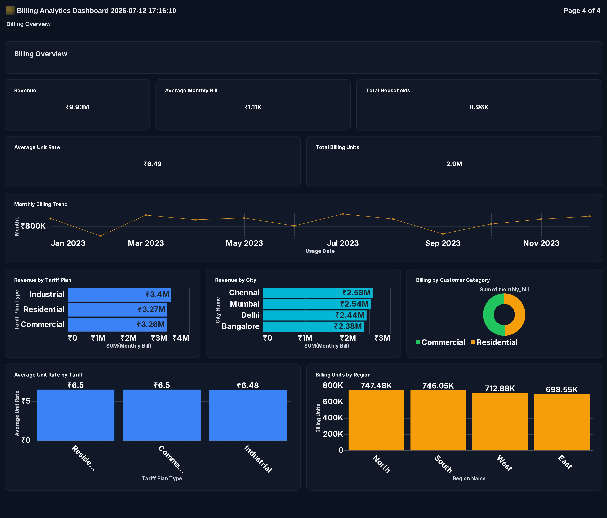
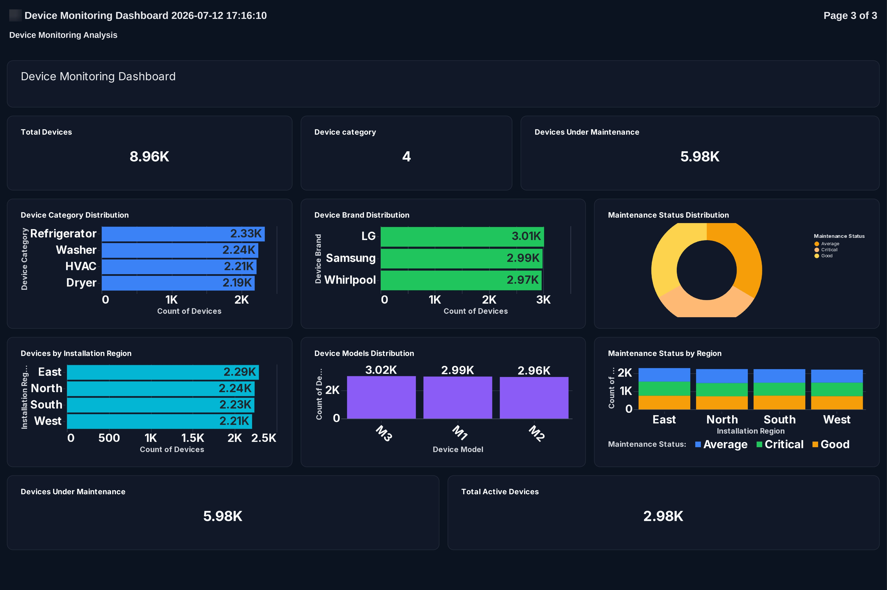

# ⚡ Energy Consumption Forecasting Pipeline
Production-ready Azure Data Engineering project for Energy Consumption Forecasting using ADLS Gen2, Azure Databricks (PySpark), Delta Lake (Bronze, Silver, Gold), Apache Airflow, and Power BI. Implements ETL, data quality checks, feature engineering, and Star Schema modeling for analytics and reporting.

## 📖 Project Overview

The **Energy Consumption Forecasting Pipeline** is an end-to-end Azure Data Engineering project designed to build a scalable and reliable data pipeline for energy consumption analytics and forecasting. The project follows the **Medallion Architecture (Bronze, Silver, Gold)** to ingest, transform, validate, and prepare business-ready data for reporting and analytics.

The pipeline uses Azure Data Lake Storage Gen2 (ADLS), Azure Data Factory, Azure Databricks, Delta Lake, Apache Airflow, Databricks SQL Warehouse, and Microsoft Power BI to implement a modern Lakehouse architecture.

---

#  High Level Architecture

<p align="center">
    
</p>

---

# 🥉🥈🥇 Medallion Architecture

<p align="center">
    
</p>

---

# 🛠️ Technology Stack

- Azure Data Lake Storage Gen2 (ADLS)
- Azure Data Factory
- Azure Databricks
- PySpark
- Delta Lake
- Unity Catalog
- Apache Airflow
- Databricks SQL Warehouse
- Microsoft Power BI
- Git & GitHub

---

# 📂 Project Workflow

```text
CSV Files
    │
    ▼
Azure Data Lake Storage Gen2
    │
    ▼
Azure Data Factory
(CSV → Parquet)
    │
    ▼
Azure Databricks
    │
    ▼
Bronze Layer
    │
    ▼
Silver Layer
    │
    ▼
Gold Layer
    │
    ▼
Databricks SQL Warehouse
    │
    ▼
Power BI Dashboard
```

---

# ✅ Implementation Progress

## Step 1 – Load Source Files into ADLS Gen2

**Objective**

Upload all source CSV datasets into Azure Data Lake Storage Gen2 for centralized and scalable storage.

**Activities Performed**

- Created Azure Storage Account
- Created ADLS Gen2 Container
- Uploaded source CSV files into ADLS
- Verified successful file upload

---

## Step 2 – Convert CSV Files to Parquet

**Objective**

Convert raw CSV files into Parquet format using Azure Data Factory to improve storage efficiency and query performance.

**Activities Performed**

- Created Azure Data Factory Pipeline
- Configured Source Dataset (CSV)
- Configured Sink Dataset (Parquet)
- Converted CSV files to Parquet
- Stored Parquet files back into ADLS

---

## Step 3 – Bronze Layer Implementation (Delta Lake)

### Objective

Load the Parquet datasets into Azure Databricks Bronze Layer as Delta Tables while preserving raw data and implementing metadata tracking, schema evolution, and incremental loading capabilities.

### Activities Performed

#### Bronze Catalog & Schema
- Created **Bronze_Catalog**
- Created **Bronze_SCH**
- Configured Delta Lake storage using Unity Catalog

#### Bronze Tables Created
- Bronze_Energy_Usage
- Bronze_Weather
- Bronze_Device_Metrics
- Bronze_Grid_Load
- Bronze_Tariff_Metrics

#### Metadata Tables
Created shared metadata tables:

- Audit_Log
- Watermark_Table

#### Bronze Layer Features Implemented

- Loaded Parquet files into Delta Tables
- Implemented Audit Logging
- Implemented Watermarking for Incremental Loads
- Implemented Schema Evolution using `mergeSchema`
- Added Error Handling
- Added Ingestion Timestamp for datasets without source timestamps
- Preserved raw source data in Bronze Layer
- Verified data loading using SQL queries


#### Bronze Layer Structure

```text
Bronze_Catalog
│
└── Bronze_SCH
    │
    ├── Audit_Log
    ├── Watermark_Table
    │
    ├── Bronze_Energy_Usage
    ├── Bronze_Weather
    ├── Bronze_Device_Metrics
    ├── Bronze_Grid_Load
    └── Bronze_Tariff_Metrics
```

#### Bronze Layer Status

✅ Bronze Layer Successfully Completed

# 🥈 Silver Layer

Tables
- Silver_Energy_Usage
- Silver_Weather
- Silver_Device_Metrics
- Silver_Grid_Load
- Silver_Tariff_Metrics

Features
- Null Handling
- Duplicate Removal
- Type Casting
- Data Validation
- Surrogate Keys
- SCD Type-2
- OPTIMIZE
- ZORDER
- VACUUM

# 🥇 Gold Layer - Used DBT

Dimensions
- dim_date
- dim_household
- dim_region
- dim_device
- dim_tariff

Facts
- fact_energy_usage


dbt Models
- Staging
- Intermediate
- Dimensions
- Facts
- Summaries
- KPIs

# 🔄 Pipeline Orchestration

- Apache Airflow (Docker)
- Databricks Workflows
- Automated Scheduling
- Task Dependencies
- Retry Mechanism

# 📢 Monitoring

- Audit Log
- Slack Notifications
- Workflow Monitoring
- Pipeline Status

# ✅ Testing

- dbt Tests
- Pytest
- SQL Validation

## Executive Dashboard

Provides an overview of key business KPIs including total households, total energy consumption, total revenue, average tariff, and peak demand.

<p align="center">
  
</p>


---

## Weather Impact Dashboard

Shows the impact of weather conditions such as temperature, humidity, rainfall, and wind speed on energy consumption.

<p align="center">
  
</p>


---

## Billing Analytics Dashboard

Provides insights into monthly billing, tariff plans, regional revenue, and customer billing behavior.

<p align="center">
  
</p>

---

## Device Monitoring Dashboard

Monitors device categories, maintenance status, runtime, efficiency, and regional device distribution.

<p align="center">
  
</p>

# 🎯 Business Outcomes

- Automated and scalable data pipeline.
- Improved data quality and governance.
- Reliable business reporting.
- Reduced manual effort.
- Supports future forecasting and decision making.

# 👨‍💻 Author

**Bhawna Bhoyar**

Azure Data Engineer

